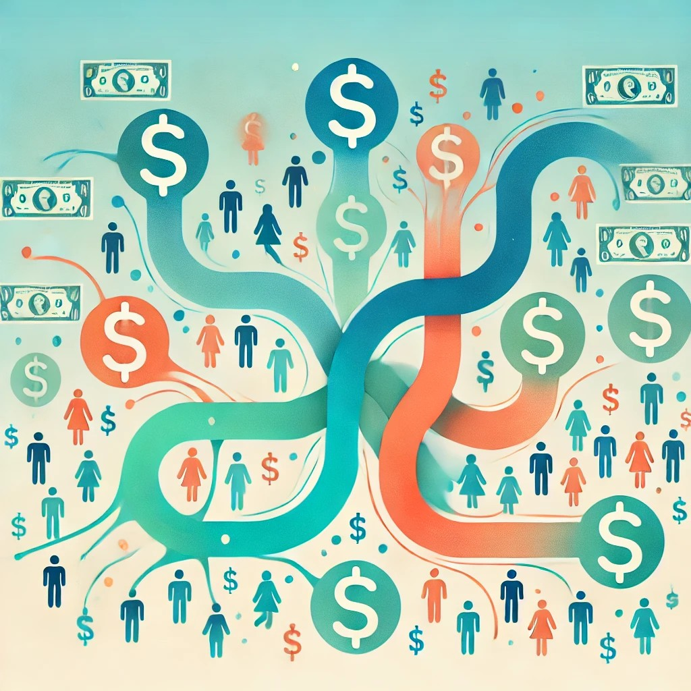

<link rel="stylesheet" href="style.css" />

## Leader and Complex Systems Scientist
##### Next Generation Governance and Decision-Making

<h3 style="text-align: left"> Research Interests </h3>

    
        

        
Simulation Accessibility

        

            I am interested in how to create a simulation ecosystem that allows users to rapidly create and customize valid simulations to aid their decision-making. Whether a family planning a day trip, a manager trying to determine the impact of resource allocations, or world leaders debating effective national and international governance.   
            I think the integration of GPTs that can generate agent behavior combined with multi-agent reinforcement learning and reinforcement human feedback learning makes this once insurmountable task highly feasible. 
        

    

    
        

        
Financial Metabolism

        

            I am interested in how societies metabolize finance and the impact that processing has on their socio-culture-political- economic evolution and and associated emergent behavior as a population.   
            This approach thinks of money as an energy stream following through groups allowing or restricting their options which then has impact over time on how that population functions. Although this focuses on finance, societies are non-decomposable and culture and information streams shape how people view their energy stream (e.g. outrage or acceptance) and the decisions they make.    
        

    

    
        

        
Societal Phase Transitions

        

            Complex systems demonstrate signatures when they are about to transition from one dynamic state to another dynamic state. These signatures are seen in the human brains transition from a depressive to non-depressive state and ecologies transitioning from one state to another, such as a forest to a savannah.  
            What are the signatures of human society as its stability (its homeorhesis) starts to weaken and it transitions from one dynamic state to another, such as an autocracy to a democracy, and how we rigorously assess which new dynamic state it will transition too?   
        

    

    
        

        
Open Source Dynamics

        

            Open Source Software has proven to be an an incredible decentralized problem solving network, enabled by the internet, coding repositories and git. Understanding more effectively how these dynamics work can prove incredibly insightful into  understanding optimal organization and problem solving dynamics to aid organizational and societal governance. 
        

    

