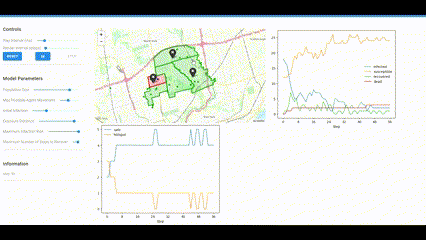

<link rel="stylesheet" href="style.css" />

## Leader and Complex Systems Scientist
##### Next Generation Governance and Decision-Making
 

 
<h2 style="text-align: left;">Mesa Co-Lead </h2>
 

I have been a Mesa contributor since 2018. Open Source is an exceptional way to find passionate problem solvers across the globe and solve hard problems together. Beside contributions and code reviews to help take Mesa from version 0 to version 3, I have helped lead Mesa to be selected for Google Summer of Code, become NumFOCUS affiliated, and be selected for small development grants. I am honored to work with the exceptional Mesa Dev Community everyday!   

<h2 style="text-align: left;">Mesa
    
</h2>

Mesa allows users to quickly create agent-based models using built-in core components (such as spatial grids and agent schedulers) or customized implementations; visualize them using a browser-based interface; and analyze their results using Python’s data analysis tools. It is Mesa's Goal to lead the Agent Based Model community in accessible, valid ABMs to aid understanding of Complex Systems. 

<h3 style="font-size: 2.50em;"> Explore Mesa  </h3> 

    <!-- Mesa GIF -->
    <figure>
        
        <figcaption>Mesa</figcaption>
    </figure>

    <!-- Mesa-Geo GIF -->
    <figure>
        
        <figcaption>Mesa-Geo</figcaption>
    </figure>

