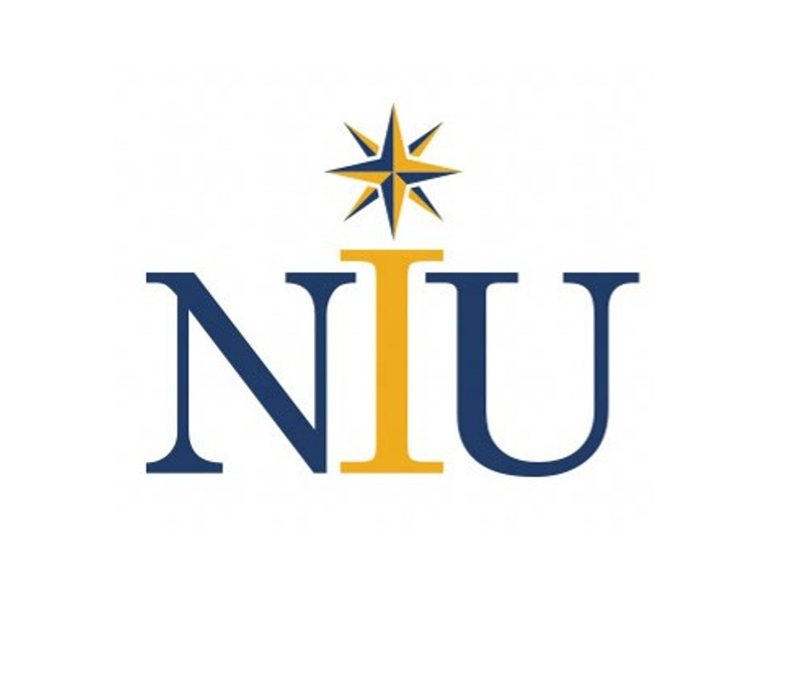

<link rel="stylesheet" href="style.css" />

## Leader and Complex Systems Scientist
##### Next Generation Governance and Decision-Making
 

<h3>
    
</h3>
<h2>National Intelligence University</h2>

 
From August 2019 to Present I have been assigned to the National Intelligence University as part of the U.S. Army's Professor of Strategic Intelligence Program.

    
        

        
Dean, Oettinger School of Science and Technology Intelligence

        

        
 &emsp; I served as Dean from November 2021 to August 2024 (when I requested to step down to retire). 

            <ul>
                <li> Led the U.S. Intelligence Community's Science and Technology Intelligence education program, which focuses on the assessment and integration of science and technology for competitive advantage. During my tenure, I significantly increasing the level of  technical education in the curriculum and the associated technical literacy of the School's students </li>
                 
                <li> Led and coordinated 60+ research projects annually, driving the integration of cutting-edge technologies notably AI and quantum technology into analysis, collection, sensemaking, cybersecurity, and economics. Research efforts resulted in everything from policy updates to AI tools immediately integrated into organizations. </li>
                 
                <li> Initiated and led the University research cloud creation and management. The research cloud enabled global AI projects for both US and allied organizations.</li>
                 
                <li> Shaped University business processes to create transparent and predictable resource allocation, while still allowing for adaptability. This resulted in reforming the business dynamics of the University, reducing frustration and increasing trust.</li> 
                 
                <li> Led an interagency effort to develop modern ways to consistently understand and examine financial digital signatures.</li>
                 
                <li> Reformed School curriculum assessment processes to integrate transparent, explainable, ethical and effective data pipelines, data analysis to include AI approaches, and end user tools for use across the University. Effectively and positively influencing the culture of the faculty.</li> 
                 
                <li>Led engagement with allied partners resulting in an international AI Wargame to enable better technology integration, collaborative international research, and the development of an allied Science and Technology Intelligence curriculum.</li>
            </ul>
        

    

    
        

        
Faculty, Cyber Intelligence and Data Science

        

        
 From August 2019 to November 2021 I served as faculty member in the Cyber Intelligence and Data Science Department co-building the data science curriculum 

            <ul>
                <li> Created half of NIU’s data science curriculum resulting in a program that is accessible to beginners as well as experienced data scientists, dramatically increasing technical literacy. The data science program quickly became the most technical curriculum at NIU. The curriculum educates students to effectively apply data science techniques (e.g. Statistics, Machine Learning, Deep Learning, Simulation) in practical effective ways to address the hard problems of national security. </li>
                 
                <li> Developed and executed a curriculum to holistically at look the dynamics of U.S. security through the rapidly evolving financial technology landscape, the dynamics of global supply chain, and the impact of finance and governance on emergent socio-cultural-political-economic societal behavior. I also conducted research along these themes.</li>
                 
                <li> Led a research program on the dynamics of decentralized problem-solving to find optimal solutions across multiple organizations. In this case focusing on understanding the open source software dynamics and its emergent problem solving processes.</li>
                 
                <li> Created NIUs Data Visualization course ensuring collaboration and validation from world leading experts from Pacific Northwest National Labs.</li>
                 
                <li> Led over 20 research projects that created data science approaches for national security applications.</li>
            </ul>
        

    

